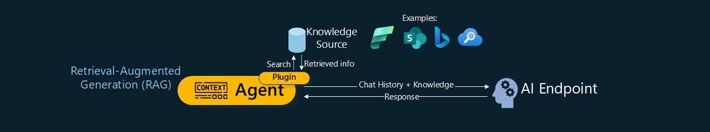
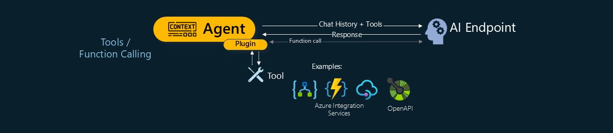
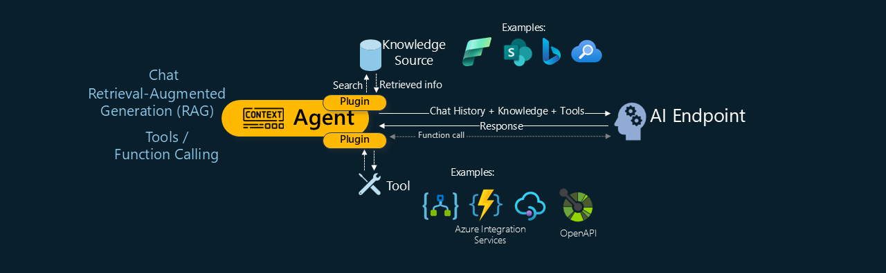
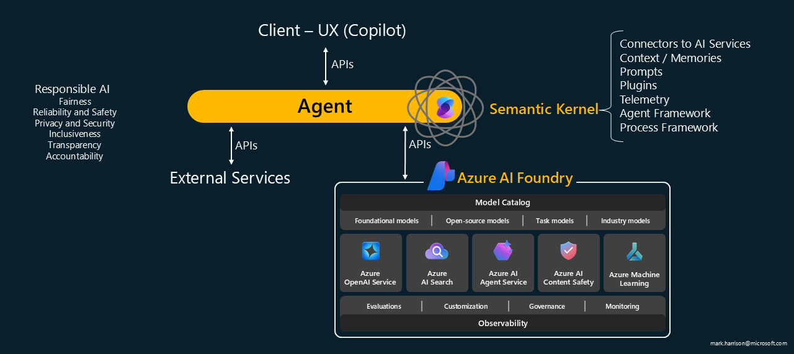

# Why MCP?

To understand why MCP is needed, lets start by looking at the patterns that modern AI Agents rely on.

## Common AI Patterns

### Chat

The Chat pattern is a conversational interface between an Agent and an AI Endpoint, typically using natural language, though it can also involve structured inputs or metadata depending on the use case.

The first message sent to an AI endpoint includes a system prompt, which defines the AI's behavior (e.g., "You are a helpful assistant. Be professional."), and a user prompt, which contains the actual request or question from the user.

The AI's response is then added to the chat history, and each subsequent message builds on this context. Over time, the AI refines its understanding of the user's intent, delivering increasingly relevant responses.

However, these AI endpoints have a key limitation: they are trained only on data available up to a specific cut-off date. Their training data is typically public, meaning they lack access to domain-specific or proprietary knowledge.

To address this, one option is fine-tuning—a process in which the base model is retrained on custom data to better align with specific goals or domains. While effective, fine-tuning is computationally expensive, time-consuming, and requires ongoing maintenance as data evolves.

This is where the next pattern, Retrieval-Augmented Generation, can help.

### RAG - Retrieval-Augmented Generation

The Retrieval-Augmented Generation (RAG) pattern enhances model responses by retrieving relevant external knowledge at runtime. This allows the AI to incorporate up-to-date or proprietary information into its answers—without requiring retraining of the base model.

It works by having the agent, during a conversation, access an external knowledge source, extract relevant content based on the user's query, and include that information in the chat message.

For example, it might use Bing to fetch the latest data from the internet, or pull organization-specific knowledge from an internal system like SharePoint.

### Tool/Function Calling

The Tool / Function Calling pattern extends AI capabilities by integrating with external APIs and services.

The AI endpoint is made aware of a predefined set of tools it can use to perform actions, retrieve data, or execute code. As the conversation progresses, the AI evaluates user intent and decides whether to invoke one of these tools.

Examples of tools include:

- Azure Functions – to execute serverless code  
- Azure Logic Apps – to trigger workflows  
- OpenAPI-defined endpoints – to call APIs

This pattern transforms the AI from a reactive conversational agent into an intelligent application capable of interacting with external systems—for example, issuing alerts, executing queries, or performing operational tasks.

### Combined: Chat + RAG + Tool Use

Bringing it all together, the complete pattern combines chat, RAG, and tool calling into a single, powerful system.

## Microsoft AI Agent 

Let's reimagine the pattern as a three-tier architecture, offering a clearer separation of responsibilities across the system:

At the core of the system is the agent itself — the brain of the application. This is where intelligence, reasoning, and decision-making occur. The agent manages context, interprets user intent, and determines how to respond or which tools to invoke.

The front-end layer is how the agent is accessed. This could be a user-facing interface, like Microsoft Copilot, or another agent interacting programmatically. It captures input and handles responses.

The back-end layer connects the agent to external data and services. This includes AI models and services, tool and function calling mechanisms, data retrieval systems (such as RAG), and third-party APIs like weather services or calendar integrations. By leveraging this layer, the agent can augment its capabilities, access real-time information, and take meaningful actions—moving beyond static responses to deliver dynamic, context-aware outcomes.

### Semantic Kernel

There are various software libraries available for building AI applications. Microsoft's solution is the Semantic Kernel - an open-source, lightweight, and extensible framework designed to reduce the amount of code developers need to write. It is fully supported by Microsoft, so if users encounter issues, they can reach out for assistance.
connectors to AI services, so if an application uses OpenAI today but needs to switch to an alternative model later, developers can simply change the connector without modifying the application logic. Additional features include memory and context handling, prompt management, and plugins for integrating with external APIs like weather services or Bing Search. Telemetry capabilities help with application observability. Semantic Kernel also includes two sub-frameworks: the Agent Framework, which manages interactions between multiple agents, and the Process Framework, which supports event-driven process management.

### Azure AI Foundry 

Azure AI Foundry is Microsoft's unified platform for building, customizing, and deploying AI applications and agents at scale. It provides a full AI toolchain, including access to a broad range of foundation models, the Azure AI Agent Service for orchestrating agent behavior, and seamless integration with Azure services. Designed for enterprise-grade production, it also embeds responsible AI principles—fairness, reliability, safety, privacy, inclusiveness, transparency, and accountability—through built-in governance, observability, and compliance tools.

## The Problem 

While these AI patterns unlock powerful capabilities, they also introduce significant integration challenges. Every service is different, with unique APIs, endpoints, message formats, and authentication schemes. 

As a result, developers are forced to build and maintain custom logic for each integration. This not only increases technical debt but also makes scaling more burdensome. As the number of tools expands, complexity grows—slowing innovation, reducing agility, and making it harder to adapt to change

## The Solution - Plug & Play 

Those old enough will remember the PCs of the nineties—and what a pain it was to install new hardware like printers or sound cards. Then along came Plug & Play (PnP) and USB, supported by Windows 95 - you just connected the device, and it would automatically recognized, drivers installed and configured ... and it just worked.

Developers need the same level of plug-and-play simplicity for AI services. That's exactly what the Model Context Protocol (MCP) delivers: a standard mechanism for integrating tools and services. MCP abstracts away API complexities, letting you focus on building intelligent agents—not grappling with interfaces.
