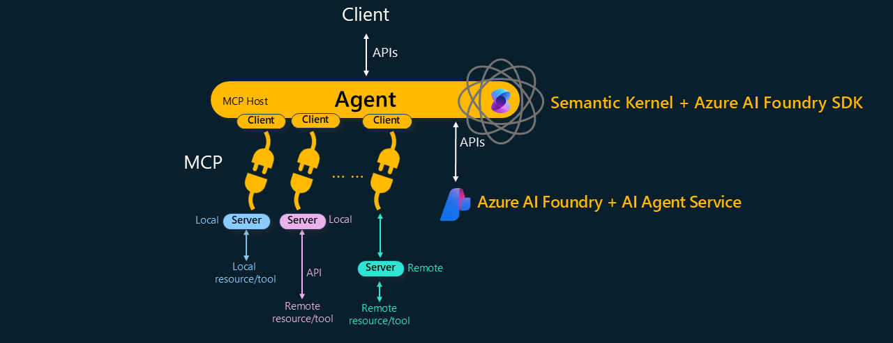

# What is MCP?

The Model Context Protocol (MCP) is an open standard designed to enable intelligent AI applications to seamlessly communicate and interoperate with a wide range of external tools and services. MCP abstracts away integration complexities by defining a unified, extensible communication layer that supports context-aware interactions.

[https://modelcontextprotocol.io/](<https://modelcontextprotocol.io/>)

## Overview of MCP

### Architecture

MCP is structured around a modular client-server architecture consisting of three primary components:

- Server: The service or knowledge provider, which exposes functionality or data to external clients. 

- Client: Acts as a communication endpoint, maintaining a 1:1 connection with a specific Server instance. Clients manage the request/response lifecycle and facilitate context exchange.

- Host: The host manages one or more clients, and provides the MCP-enabled services to the intelligent application

This design separates concerns cleanly:

- Resource owners manage Server implementations, controlling service logic and data.

- Application developers integrate MCP clients into their hosts, enabling plug-and-play extensibility without needing to know about the service internals.

### Transport protocols

MCP supports two primary transport mechanisms:

- Standard In/Out: Designed for local services running on the same machine, leveraging standard input/output streams.

- HTTP (Streamable): Facilitates remote communication over the web. 

Note some documentation refers to SSE (Server-Sent Events) - this has recently been deprecated in favor of standard HTTP streaming.

## MCP Ecosystem

The MCP ecosystem is expanding rapidly, with hundreds of compliant services available. Integrating these services into intelligent applications requires minimal configuration.

Catalogs of MCP compliant tools include:

- [https://github.com/modelcontextprotocol/servers](<https://github.com/modelcontextprotocol/servers>)
- [https://github.com/punkpeye/awesome-mcp-servers](<https://github.com/punkpeye/awesome-mcp-servers>)

 