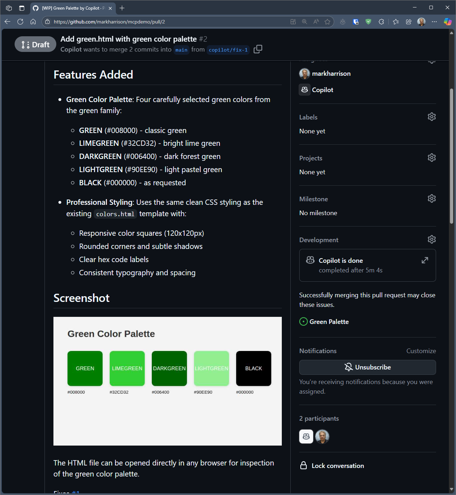

# MCP Demo with GitHub Coding Agent

This MCP demo will use the GitHub Copilot Coding Agent. 

The Coding Agent is an autonomous, AI-powered software development agent integrated into GitHub. It can work independently to complete tasks such as fixing bugs, implementing new features, improving test coverage, updating documentation, and addressing technical debt.

## Configuration

First we need to configure MCP servers used by the Coding Agent.

- Navigate to the Repo settings 
- Select `Code and Automation` | `Copilot` | `Coding Agent`.

There is a designated area to enter the MCP servers to be used.  

- Enter the MCP server configuration, as follows:

```json
{ "mcpServers": {
        "colors" : {
            "type": "http",
            "url": "https://colorsmcp.azure1.dev/",
            "tools": ["*"]
        }
} }
```


## Demo MCP with GitHub Coding Agent 

### Create Issue 

- Create a New Issue ... enter the following and hit `Create`

```
I need a palette of four colors from the green family - plus black ...
please add to a HTML file called green.html so I can inspect.
```


### Assign the issue to Copilot

- Assign the Issue to Copilot ... this will kick off the Coding Agent


- Notice after a few seconds, Copilot picks this up and creates a draft Pull Request marked as WIP (work in progress)


- Click on the link to the Pull Request

### Check on the Session

Copilot starts to add its thinking and progress to the Pull Request


Click on  `View Session` to get more detailed view of Copilots activity.

The session log can be lengthy, but if you scroll down, you’ll see where Copilot calls the ColorsMCP server to retrieve the color information.


Once completed, the Pull Request is updated with a summary of the actions taken.  

A reviewer now has an opportunity to inspect what has been done and the has the option to accept the work done by Copilot.




### Final Results

The green palette HTML file created will be in the branch used by Copilot.  


We saw from the Copilot logs, that the color information knowledge was obtained from the ColorsMCP server.
