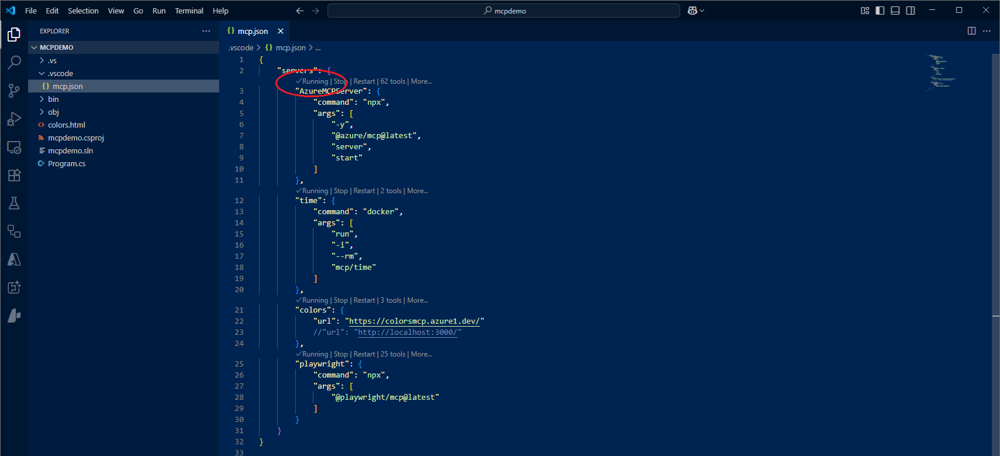
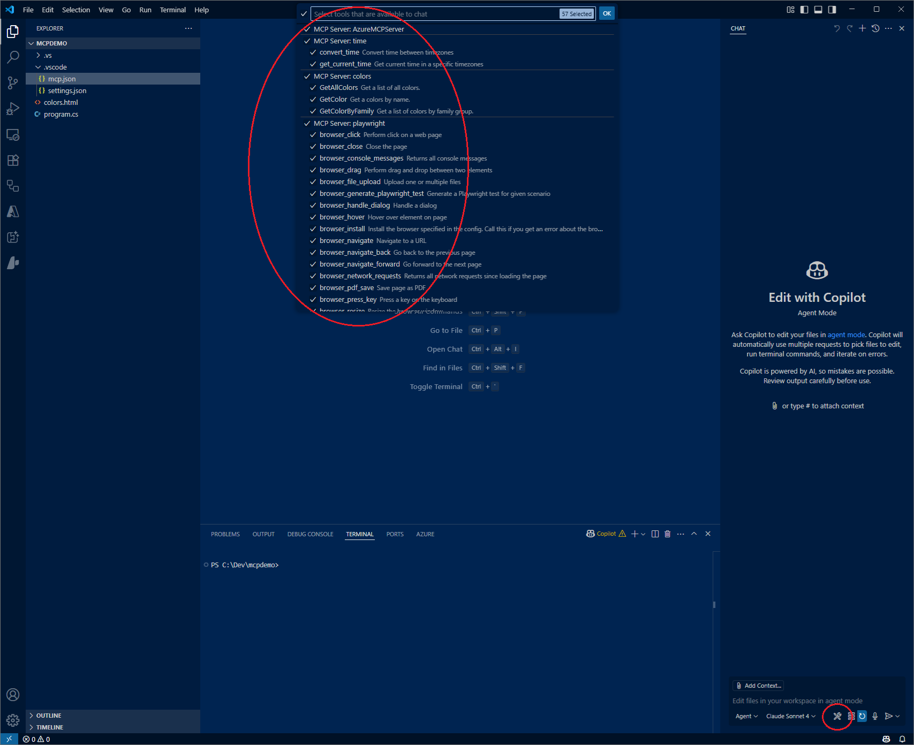
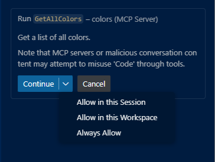
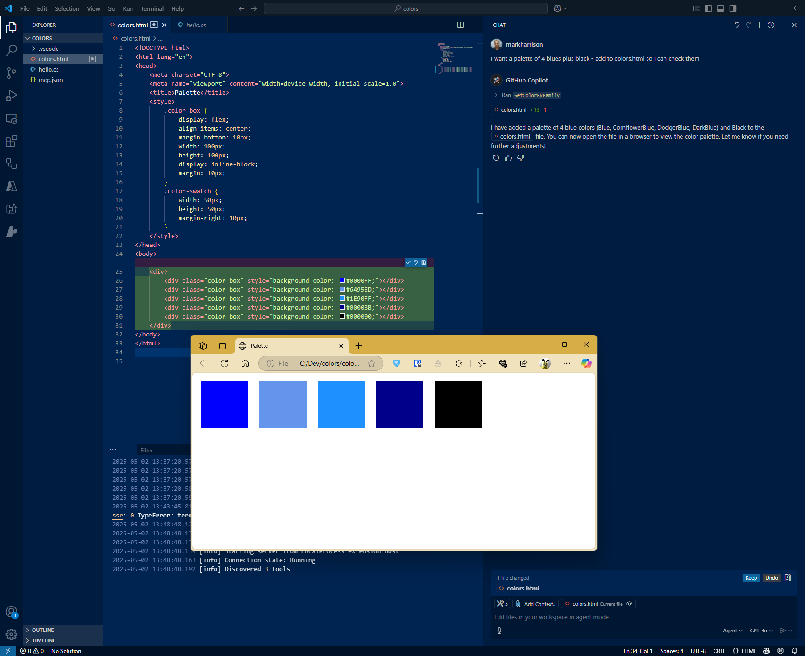
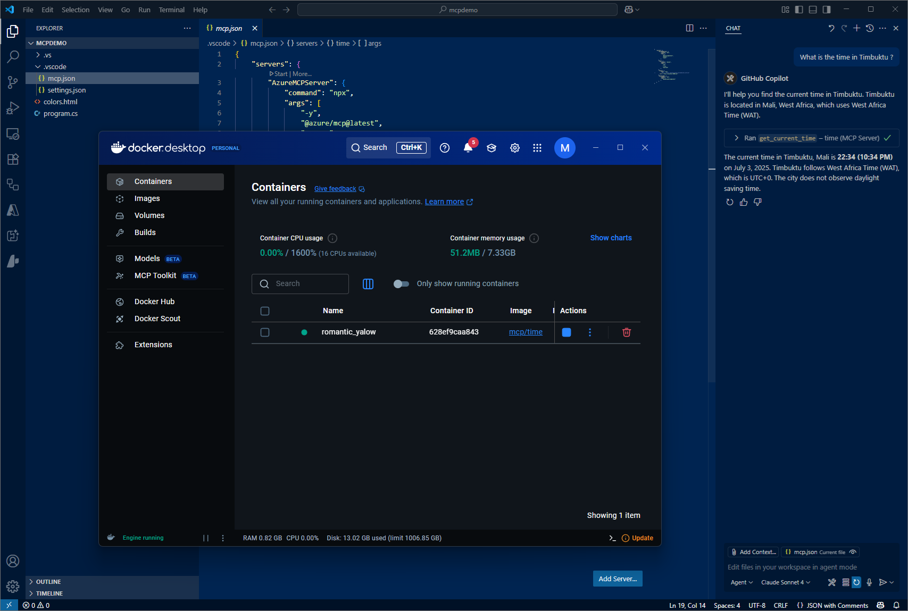
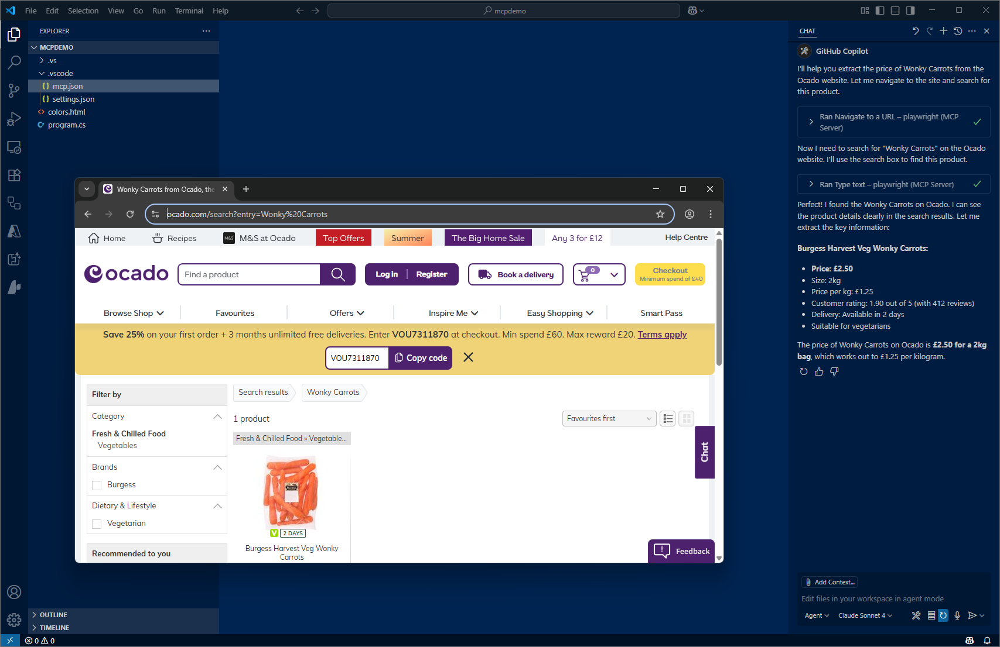
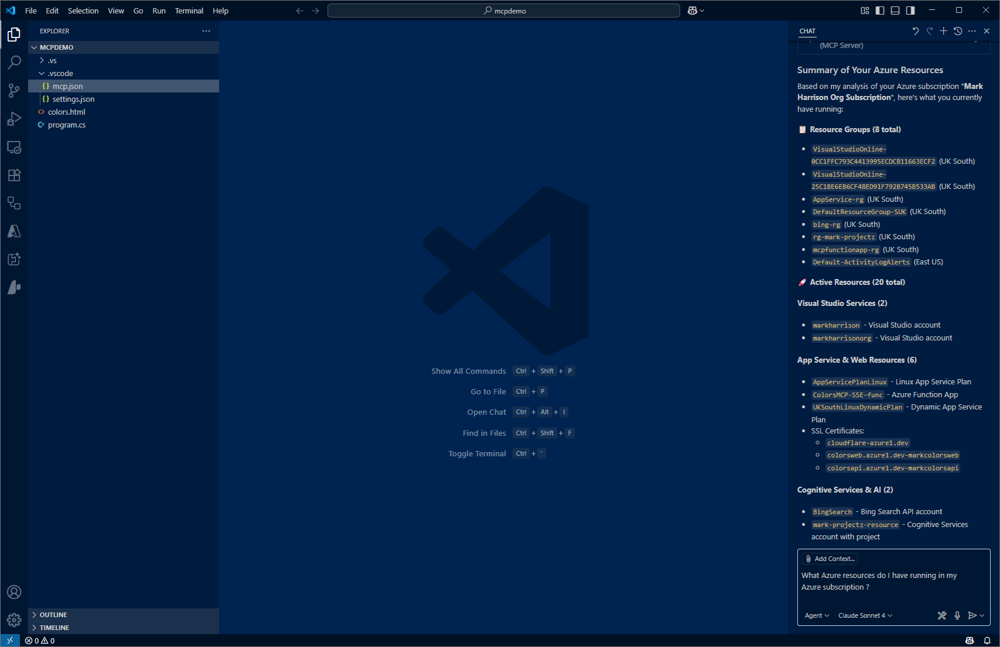

# MCP Demo

This section shows the use of several MCP tools - specifically, these will provide knowledge about Colors, Timer, Prices and Azure Resources.  

The demo will use Visual Studio Code and GitHub Copilot Agent Mode. 

## Demo video 

<iframe width="560" height="315" src="https://www.youtube.com/embed/DGr6sjK_fnk" 
title="YouTube video player" frameborder="0" 
allow="accelerometer; autoplay; clipboard-write; encrypted-media; gyroscope; picture-in-picture" 
allowfullscreen></iframe>


## Configuration

The remainder of this section, explains how to configure and run the demo. 

Project can be cloned from [https://github.com/markharrisonorg/mcpdemo](<https://github.com/markharrison/mcpdemo>).  Alternatively:

- Create an empty folder and open with Visual Studio Code.
- Create a file called .vscode\mcp.json
- Add the following content


```json
{
    "servers": {
        "AzureMCPServer": {
            "command": "npx",
            "args": [
                "-y",
                "@azure/mcp@latest",
                "server",
                "start"
            ]
        },
        "time": {
            "command": "docker",
            "args": [
                "run",
                "-i",
                "--rm",
                "mcp/time"
            ]
        },
        "colors": {
            "url": "https://colorsmcp.azure1.dev/"
        },
        "playwright": {
            "command": "npx",
            "args": [
                "@playwright/mcp@latest"
            ]
        }
    }
}

```

Note that the Colors tool runs remotely, while the other tools operate locally.  

The Time MCP server runs in a local container. Ensure that Docker Desktop (or a compatible container runtime) is running; otherwise, the server will fail to start.

## Display MCP Tools

ach server will have a grey status line displayed in the mcp.json file. Ensure that each server shows a status of "Running" and that there are no errors present.



To display the MCP tools that are available:

- Open GitHub Copilot
- Select Agent Mode
- Select the Tools icon
- See available tools listed




## Calling MCP Tools 

When an MCP tool is first used - a prompt will appear requesting permission to call the tool.  You have the option of: 

- Allow in the session
- Allow in the workspace
- Aways allow
- Cancel - do not make the call 




### Colors MCP Server

The development of the Colors MCP Server will be covered in the next section. 

In GitHub Copilot, ask the following:

```text
I need a palette of four colors from the blue family - plus black ... 
please add to colors.html so I can inspect
```



### Time MCP Server 

In GitHub Copilot, ask the following:

```text
What is the time in Timbuktu ?
```

In the screenshot, you can see the container started in Docker Desktop.




### PlayWright MCP Server

In GitHub Copilot, ask the following:

```text
Check out www.ocado.com ... extract the price of Wonky Carrots
```

Note that the GitHub MCP server includes a tool called Fetch, which can retrieve web pages. Be sure to disable it to avoid potential conflicts.

In the screenshot, you can see a web browser running in the background. It's possible to run in headless mode (without a browser UI) for faster and less intrusive execution.



### Azure MCP Server

In GitHub Copilot, ask something like the following - make it appropriate to whatever you have running in Azure:

```text
What Azure resources do I have running in my Azure subscription ?
```




