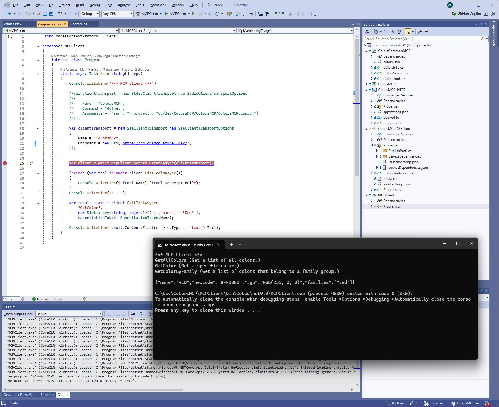
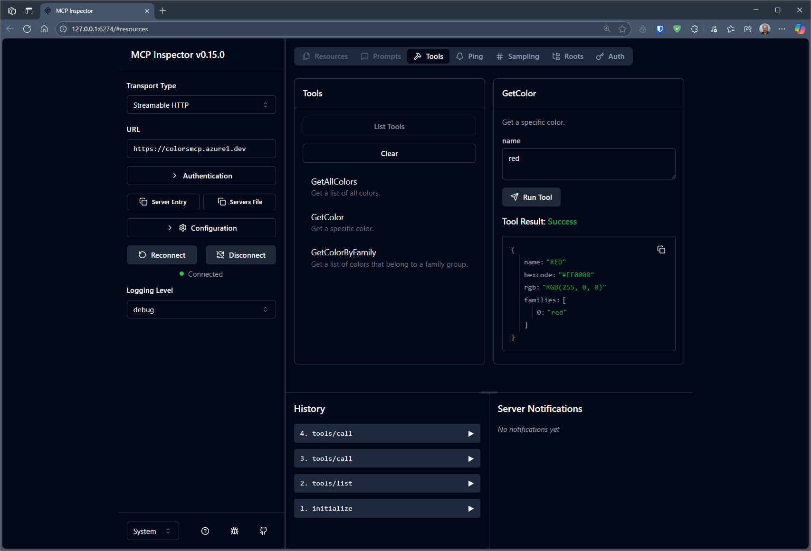

# MCP Development

In this section we shall discuss creating an MCP Server - specifically, the Colour MCP server that was covered in the previous section, and used in the demo.

## MCP SDK

To help build MCP servers with minimal effort - there are Software Development Kits (SDKS) for the following languages:  

- C# 
- Java 
- Kotlin 
- Python 
- Ruby
- Swift
- TypeScript 

Links to the different SDKS are at [https://modelcontextprotocol.io/](<https://modelcontextprotocol.io/>)

## Colors MCP

The source code to the Colors MCP server is at : https://github.com/markharrison/ColorsMCP 

It could be used as the basis of your own MCP Server - for knowledge that you want to make available to your AI applications.  So take a copy: 

```powershell
git clone https://github.com/markharrison/ColorsMCP 
```

There are several projects in the solution:

- ColorsMCP ... this uses the STDIO transport protocol
- ColorsMCP-HTTP ... this uses the HTTP Streamable transport protocol
- ColorsCommonMCP ... this is common code used by both the ColorMCP and ColorsMCP-http projects
- MCPClient ... this is a simple client project to test calling the MCP servers

The code is simple - thanks to the C# SDK, which does the bulk of the work. 

### ColorsMCP-http

Check `program.cs` to see how the server application is instantiated with MCP support.

```C#
            var builder = WebApplication.CreateBuilder(args);
            builder.Services
                .AddMcpServer()
                .WithHttpTransport()
                .WithTools<ColorsTools>();

            builder.Services.AddCors(options =>
            {
                options.AddDefaultPolicy(policy =>
                {
                    policy.AllowAnyOrigin()
                          .AllowAnyHeader()
                          .AllowAnyMethod();
                });
            });

            builder.Services.AddSingleton<ColorsService>();

            var app = builder.Build();

            var colorsService = app.Services.GetRequiredService<ColorsService>(); 

            app.UseCors();

            app.MapMcp();

            app.MapGet("/health", () => "Healthy");

            app.Run();
```

We can see that the startup logic `.WithTools` refers to a class called `ColorsTools` - this is what contains our MCP Tools.  We shall look at this in detail shortly.

### ColorsCommonMCP

The project contains our common code - that is used by the projects to support different transport protocols.

The Colors knowledge is hard coded in a JSON file.  But other such servers might access information in databases or call APIs.

```JSON
[
  {
    "name": "ALICEBLUE",
    "hexcode": "#F0F8FF",
    "rgb": "RGB(240, 248, 255)",
    "families": [ "white" ]
  },
  {
    "name": "ANTIQUEWHITE",
    "hexcode": "#FAEBD7",
    "rgb": "RGB(250, 235, 215)",
    "families": [ "white", "tan" ]
  },
  {
    "name": "AQUA",
    "hexcode": "#00FFFF",
    "rgb": "RGB(0, 255, 255)",
    "families": [ "blue", "aqua" ]
  },

  etc 

}
  ```

The three MCP Tools are located in `ColorsTools.cs`

```C#

using ModelContextProtocol.Server;
using System.ComponentModel;
using System.Text.Json;

namespace ColorsCommonMCP;

[McpServerToolType]
public sealed class ColorsTools
{
    private readonly ColorsService colorsService;

    public ColorsTools(ColorsService colorsService)
    {
        this.colorsService = colorsService;
    }

    [McpServerTool, Description(ColorsInfo.GetAllColorsToolDescription)]
    public async Task<string> GetAllColors()
    {
        var colors = await colorsService.GetColors();
        return JsonSerializer.Serialize(colors, ColorsContext.Default.ListColors);
    }

    [McpServerTool, Description(ColorsInfo.GetColorsByFamilyToolDescription)]    
    public async Task<string> GetColorByFamily(
                    [Description(ColorsInfo.GetColorsByFamilyParamFamilyDescription)] string family)
    {
        var colors = await colorsService.GetColorsByFamily(family);
        return JsonSerializer.Serialize(colors, ColorsContext.Default.ListColors);
    }


    [McpServerTool, Description(ColorsInfo.GetColorToolDescription)]
    public async Task<string> GetColor([Description(ColorsInfo.GetColorParamNameDescription)] string name)
    {
        var colors = await colorsService.GetColors(name);
        return JsonSerializer.Serialize(colors, ColorsContext.Default.Colors);
    }
}

```

The annotations on the functions are crucial, as they are used by the program logic to identify and link to the appropriate tools.

The description fields within these annotations must be clear and precise, as they are used by the AI logic to determine whether a particular tool should be called to fulfill a given request.


## Deployment 

The ColorsMCP-http project includes a Docker file to build a Docker image / container.  This makes it simple to deploy e.g. to Azure App Service.

The Command to build the container is in the repo ReadMe file.  

## Test 

A client test utility was included in the solution.  This examines the server to see what Tools it exposes, and then it invoked the Tool to get the Red information.



Alternatively use the MCP Inspector utility - instructions to run this are in the ReadMe file. 


